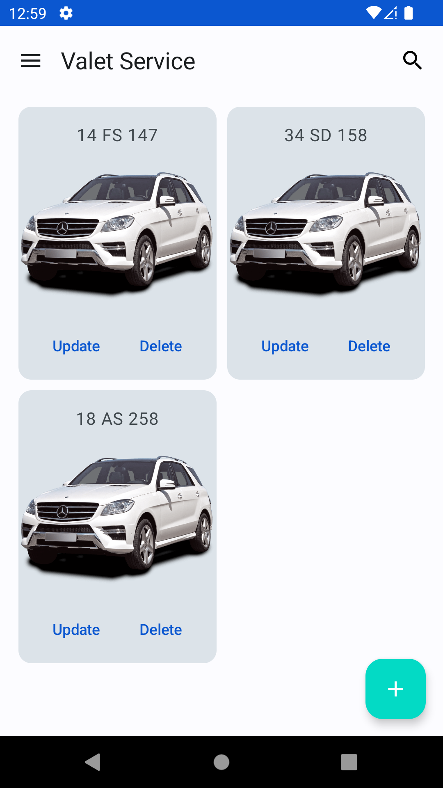
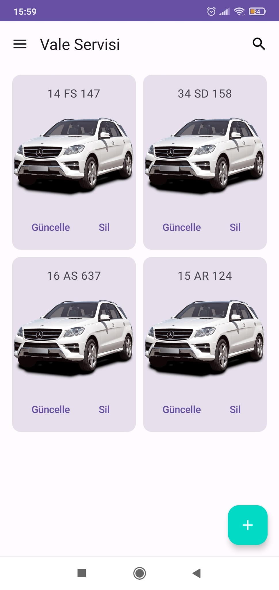
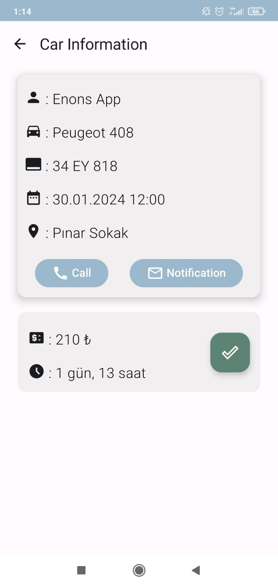
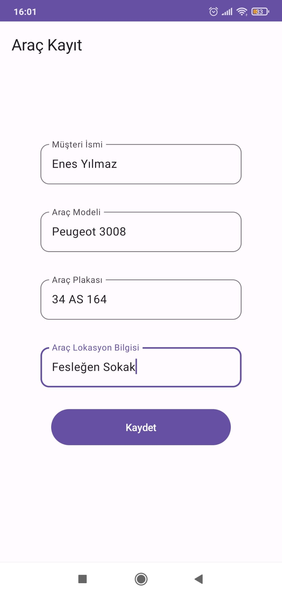
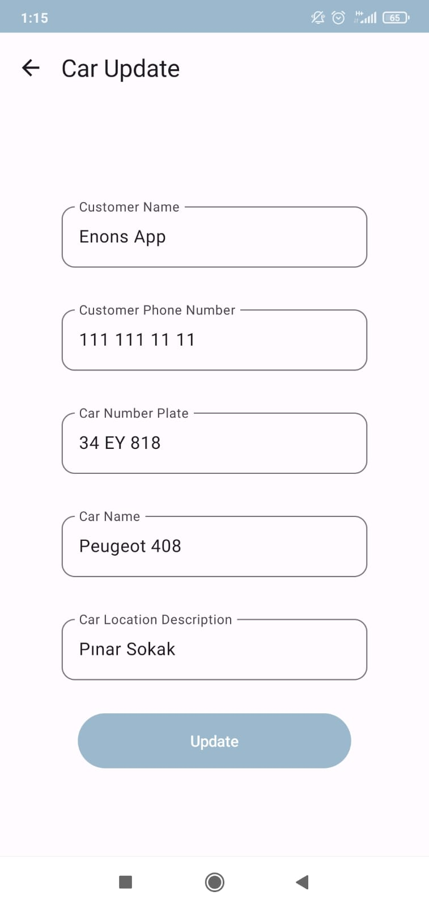
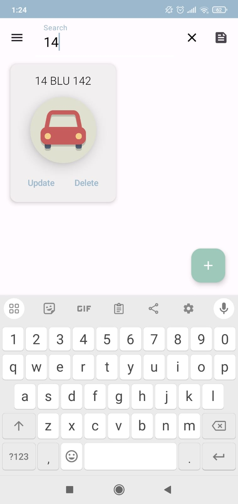
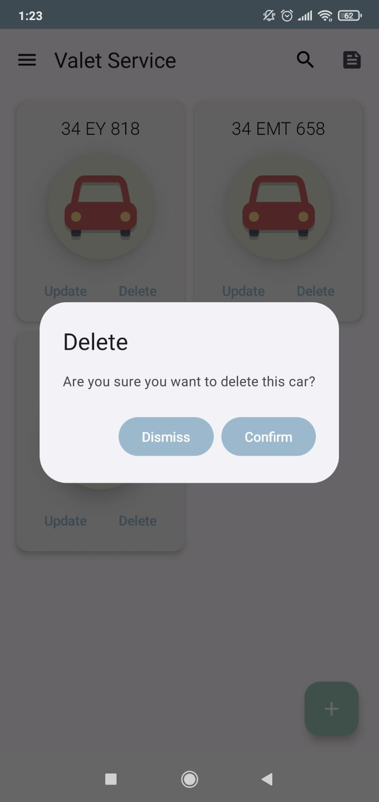

This project enables companies providing valet services to do their work in a digital environment, reliably and easily.

The main features of this project include:
	
	Valets can register new vehicles to the application.
	Valets can see the current locations and car license plates of the vehicles registered in the system.
	Valet service companies can update existing vehicles in the application.
	valet companies can easily access cars by querying car license plates

We utilized the following key technologies and tools in the development of this project:
	
	                  
	Navigation component for smooth app navigation.
	LiveData to observe and react to data changes.
	MVVM (Model-View-ViewModel) architecture for a clean and maintainable codebase.

# Valet Service App

This project enables companies providing valet services to do their work in a digital environment, reliably and easily.

## Features

The main features of this project include:

- Valets can register new vehicles to the application.
-	Valets can see the current locations and car license plates of the vehicles registered in the system.
-	Valet service companies can update existing vehicles in the application.
-	valet companies can easily access cars by querying car license plates
## Technologies

We utilized the following key technologies and tools in the development of this project:

- Navigation component for smooth app navigation.
-	LiveData to observe and react to data changes.
-	MVVM (Model-View-ViewModel) architecture for a clean and maintainable codebase.

## User Interfaces

  
  
  
  
  
  
  

