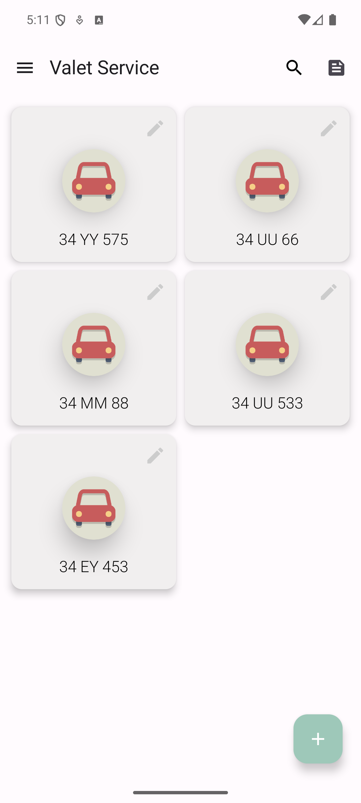
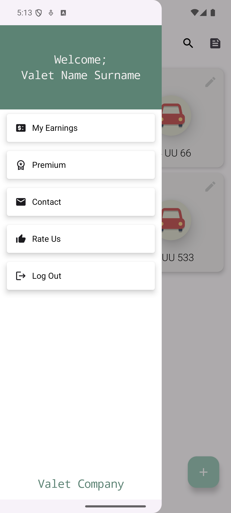
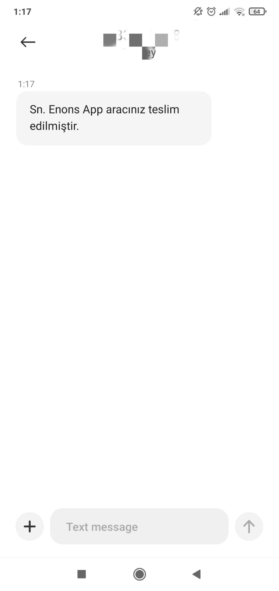

# Valet Service App &nbsp;&nbsp; <a href="https://play.google.com/store/apps/details?id=com.enons.vehicleapp"></a>


## Introduction
This project enables companies providing valet services to do their work in a digital environment, reliably and easily.

## Features

The main features of this project include:

- Valets can register new vehicles to the application.
-	Valets can see the current locations and car license plates of the vehicles registered in the system.
-	Valet service companies can update existing vehicles in the application.
-	Valet companies can easily access cars by querying car license plates.
-   An information message can be sent when the vehicle is received.
-   Calls can be made to communicate in emergencies.
-   Vehicle registration date and time can be informed to the customer by message.


## Tech Stacks

This project is trying to use the latest Android tech stacks.

- Language: [Kotlin](https://kotlinlang.org)
- Architecture: [Android App Architecture (MVVM) ](https://developer.android.com/topic/architecture)
- User Interface: [Jetpack Compose](https://developer.android.com/jetpack/compose)
- Concurrency: [Coroutines](https://kotlinlang.org/docs/coroutines-overview.html)
- Dependency Injection: [Hilt](https://developer.android.com/training/dependency-injection/hilt-android)
- Local Database: [Room](https://developer.android.com/training/data-storage/room)
- Image Loading: [Coil](https://coil-kt.github.io) 
- Others:
  - [Jetpack Compose Extensions](https://google.github.io/accompanist)
  - [Firebase Notification](https://firebase.google.com/docs/cloud-messaging?hl=tr)
  - [SplashScreen](https://developer.android.com/develop/ui/views/launch/splash-screen)
  - [Admob](https://admob.google.com/intl/tr/home/)
  - [Google Play Review](https://developer.android.com/guide/playcore/in-app-review)
  
## User Interfaces
| Home Screen | Drawer Screen | Detail Screen |
| ----- | ------------ | ------------ |
||||

</br>

| Register Screen | Update Screen | Search Screen |
| ----- | ------------ | ------------ |
||||

</br>

| Delete Dialog | Information Message Screen | Vale Message Screen |
| ----- | ------------ | ------------ |
||||

</br>

## Download

### If You Want to Use the App on an Android Phone:

* You can download the apk file of the app by clicking [here](https://drive.google.com/drive/folders/18cOxlrR9eJNvtUxZmmBriI-itHjHCdRg?usp=sharing) and install the app on your phone.
* You can click [here](https://play.google.com/store/apps/details?id=com.enons.vehicleapp) to download the application from Google Play.

## Clone Project

1. Clone this repository to your preferred directory using the following command:

```
git clone https://github.com/yildirimenes/Valet-Service
```
2. Open the cloned project in Android Studio.

3. Build and run the app on an emulator or a physical device.


## License
This project is licensed under the Apache License, Version 2.0. See the [LICENSE](LICENSE) file for details.
