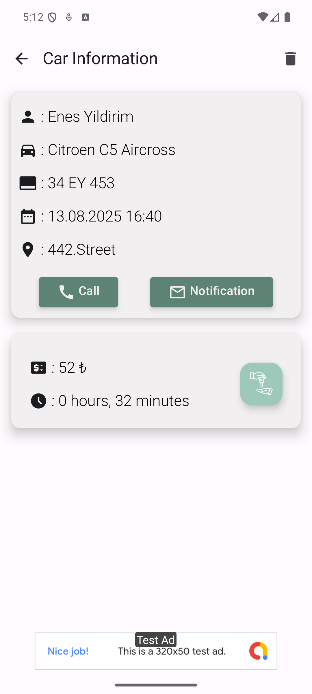
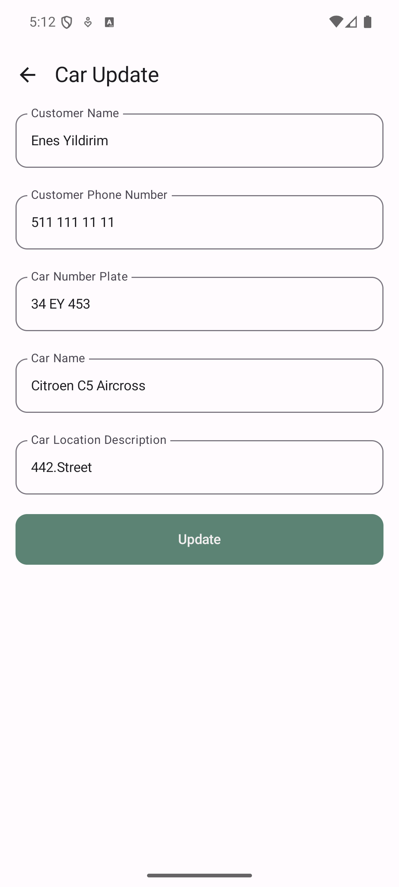
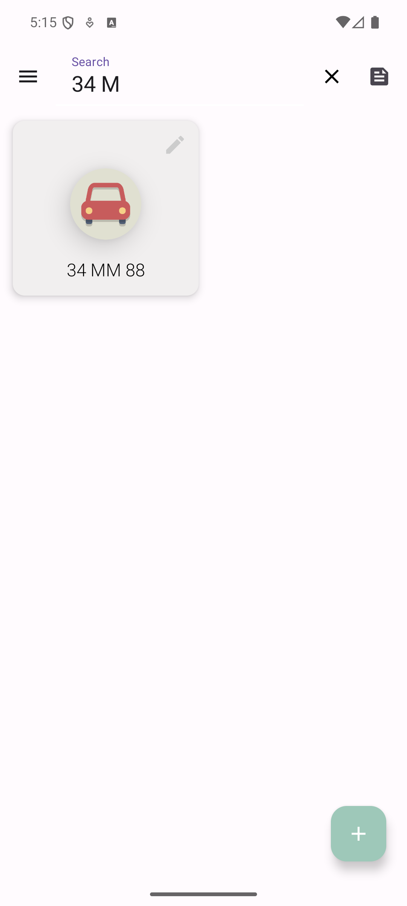
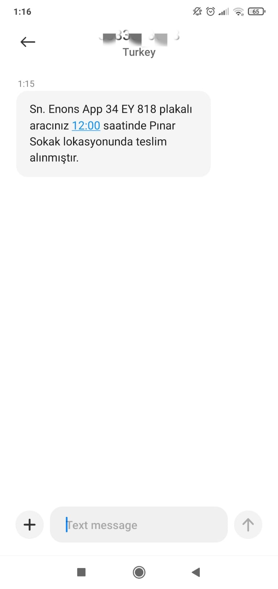

# Valet Service App

This project enables companies providing valet services to do their work in a digital environment, reliably and easily.

## Features

The main features of this project include:

- Valets can register new vehicles to the application.
-	Valets can see the current locations and car license plates of the vehicles registered in the system.
-	Valet service companies can update existing vehicles in the application.
-	Valet companies can easily access cars by querying car license plates.
-   An information message can be sent when the vehicle is received.
-   Calls can be made to communicate in emergencies.
-   Vehicle registration date and time can be informed to the customer by message.

## Tech Stacks

This project is trying to use the latest Android tech stacks.

- Language: [Kotlin](https://kotlinlang.org)
- Architecture: [Android App Architecture (MVVM) ](https://developer.android.com/topic/architecture)
- User Interface: [Jetpack Compose](https://developer.android.com/jetpack/compose)
- Concurrency: [Coroutines](https://kotlinlang.org/docs/coroutines-overview.html)
- Dependency Injection: [Hilt](https://developer.android.com/training/dependency-injection/hilt-android)
- Local Database: [Room](https://developer.android.com/training/data-storage/room)
- Image Loading: [Coil](https://coil-kt.github.io) 
- Others:
  - [Accompanist](https://google.github.io/accompanist) (Jetpack Compose Extensions)
## User Interfaces

  
  
  
  
  
  
  
  
  

